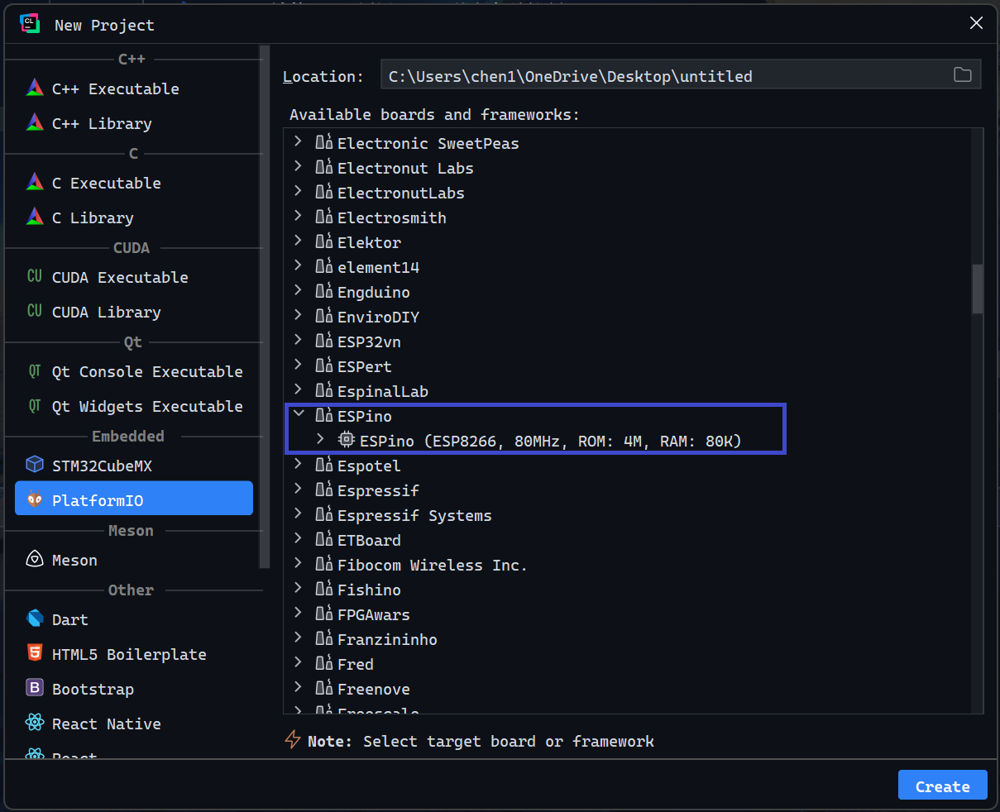
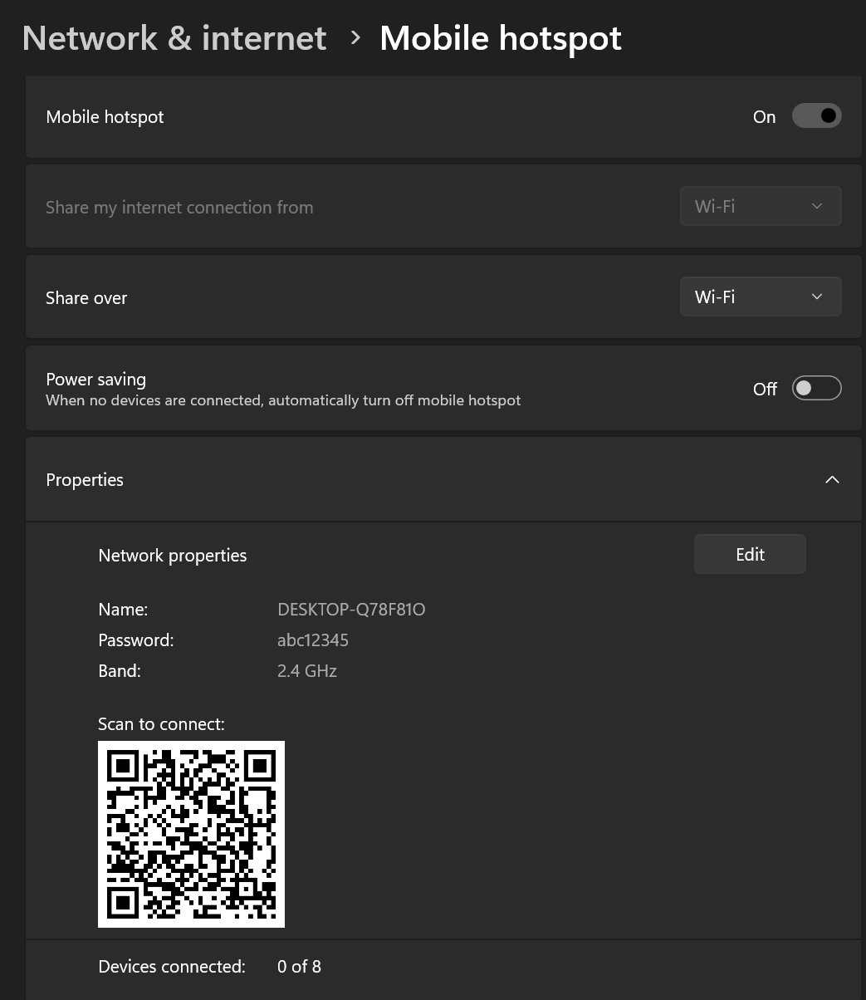
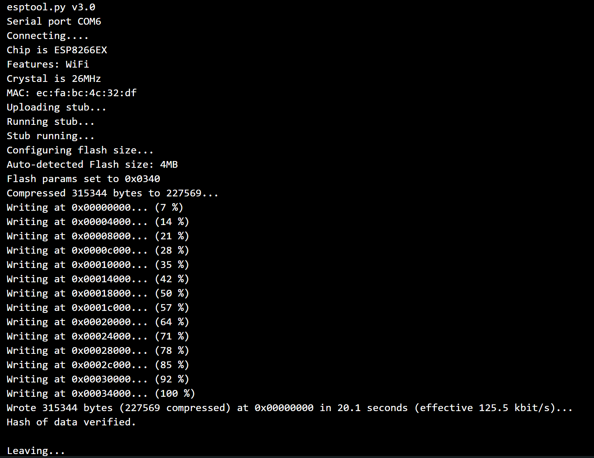
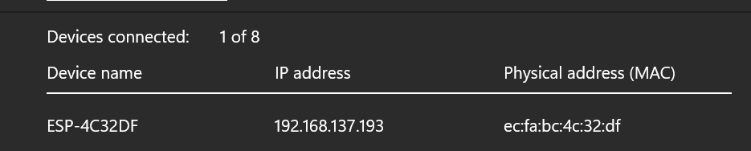
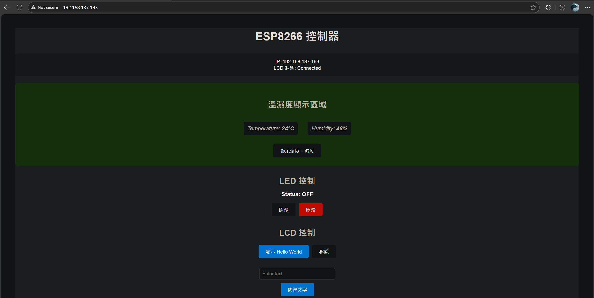

# ESP8266 IoT Controller

一個基於 ESP8266 的物聯網控制系統，透過 WiFi 進行無線控制

## 功能
- DHT11 溫濕度監測 - 回傳溫度和濕度數據到電腦
- LED 遠程控制 - 透過介面控制 LED 亮暗 
- LCD 1602 - 顯示`Hello World`或自定義文字

## 硬體需求
- ESP8266 開發板 (ESPino)
- DHT11 溫濕度感測器
- LCD 1602 顯示器 (I2C 接口)
- LED
- 連接線
## 腳位

LED
- `LED_PIN` GPIO14
- GND

DHT11
- `+` 5V
- `DHT_PIN` GPIO2
- `-` gnd

LCD
- `GND` GND
- `VCC` 3.3V
- `SDA_PIN` GPIO4
- `SCL_PIN` GPIO5

注意：GPIO 在板子後面
## 前置
### 1. 安裝及開啟板子
以 clion 為例，直接用



而 Arduino 要匯入以下路徑，再去 Board > Boards Manager 下載 esp8266
```txt
https://arduino.esp8266.com/stable/package_esp8266com_index.json
```
### 2. 開啟電腦的熱點



注意
- Band 必須是 2.4GHz 如果是 5.0GHz 則無法連
- Power saving 建議是關閉，因為運行時不會突然關掉
- Name 和 Password 用你的設置，分別對應`ssid`和`password`
### 3. 設置 Serial Monitor
以 clion 為例，使用與 arduino 庫相同路徑和定義 upload_speed 固定 115200，upload_port 要隨使用者真實連接的 Port 號
```txt
[env:espino]
platform = espressif8266
board = espino
framework = arduino

; 使用 Arduino IDE 的路徑
lib_extra_dirs =
    C:/Users/chen1/OneDrive/文件/Arduino/libraries

; 上傳設定 - 降低速度提高穩定性
upload_speed = 115200
upload_port = COM6
upload_resetmethod = nodemcu
monitor_speed = 115200
```
而 Arduino 打開 Serial Monitor
- 設置 Both NL&CR
- 設置 115200 baud
### 4. 運行
兩者都會看到類似以下效果看到就表示成功了



顯示的 IP address 可以直接貼上網頁



## 主畫面
如果畫面異常請重刷新



## 心得
- 2025/11/27
- 最近的作業，稍微有點難度
> 因為寫習慣 CLion 開發韌體，但是自己對這塊板子陌生，將就用 Arduino IDE 先把程式碼測試功能完整，
> 後來(晚上)想辦法解決配置問題，感謝組員提供相關參考資源與實驗版。程式過程中最大的難點就是我當時不知道它的腳位實際寫在板子後面，程式對但是接錯地方無用。
> 後面碰巧接錯卻可以用，後請教老師才了解。另外，我解決了筆電連接無法連接 AP 網域的問題，而是要自己開熱點，讓板子去連筆電。
