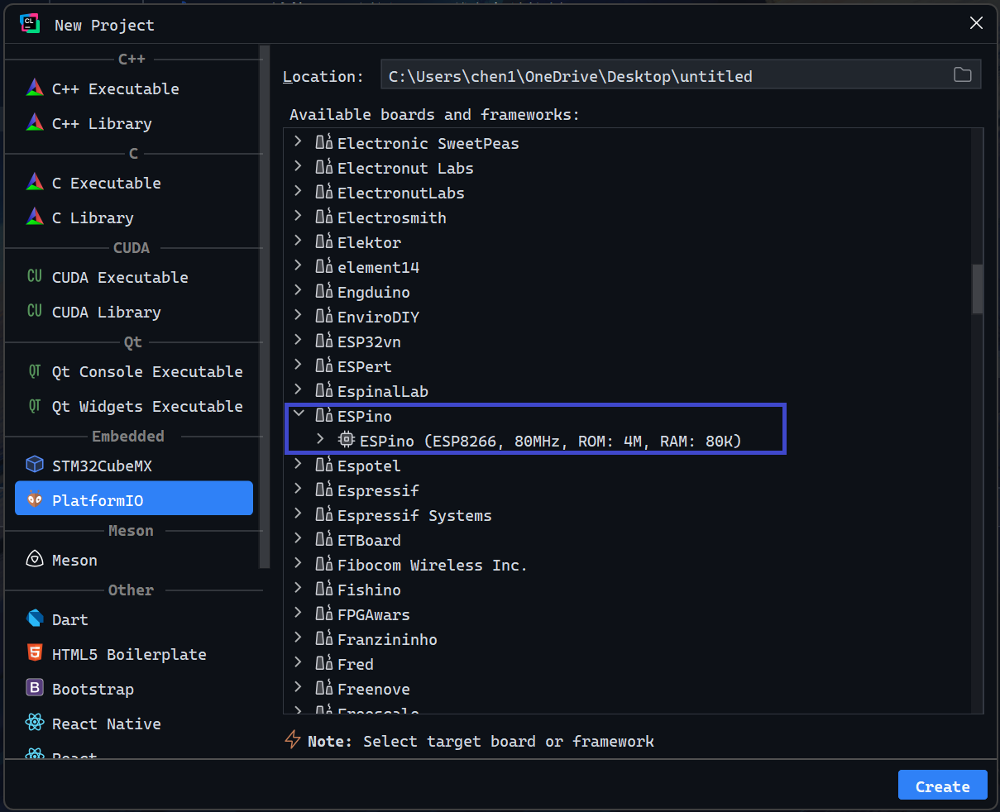
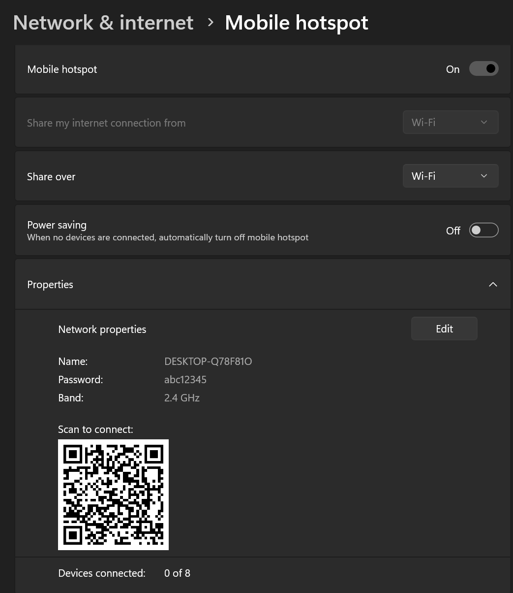
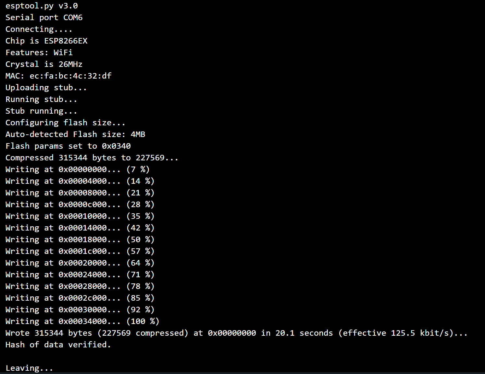
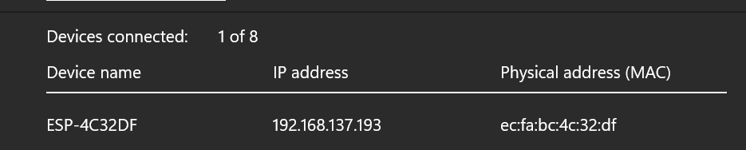
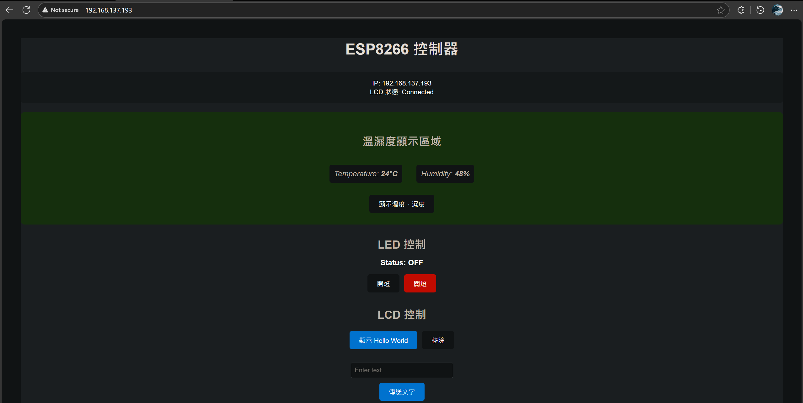

# 智慧房間環境監控系統

## 專案簡介
結合環境感測、設備控制與即時顯示的物聯網應用，透過 WiFi 實現遠端監控與操作，提升室內環境管理的便利性與即時性，
適合本地測試用

## 功能
- DHT11 溫濕度監測 - 回傳溫度和濕度數據到電腦
- LED 遠程控制 - 透過介面控制 LED 亮暗 
- LCD 1602 - 顯示`Hello World`或自定義文字

## 硬體需求
- ESP8266 開發板 (ESPino)
- DHT11 溫濕度感測器
- LCD 1602 顯示器 (I2C 接口)
- LED
- 連接線

## 元件的腳位

LED
- `LED_PIN` GPIO14
- GND

DHT11
- `+` 5V
- `DHT_PIN` GPIO2
- `-` gnd

LCD
- `GND` GND
- `VCC` 3.3V
- `SDA_PIN` GPIO4
- `SCL_PIN` GPIO5

注意：GPIO 在板子後面
## 前置
### 1. 建立專案
以 clion 為例，或直接下載本專案做測試



而 Arduino 要匯入以下路徑，再去 Board > Boards Manager 下載 esp8266
```txt
https://arduino.esp8266.com/stable/package_esp8266com_index.json
```
### 2. 開啟電腦的熱點



注意
- Band 必須是 2.4GHz 如果是 5.0GHz 則無法連
- Power saving 建議是關閉，因為運行時不會突然關掉
- Name 和 Password 用你的設置，分別對應`ssid`和`password`
### 3. 設置 Serial Monitor
以 clion 為例，使用與 Arduino 庫相同路徑和定義 upload_speed 固定 115200，upload_port 要隨使用者真實連接的 Port 號
```txt
[env:espino]
platform = espressif8266
board = espino
framework = arduino

; 設定 Arduino IDE 的路徑
lib_extra_dirs = C:/Users/chen1/OneDrive/文件/Arduino/libraries

; 上傳設定
upload_speed = 115200
upload_port = COM6
upload_resetmethod = nodemcu
monitor_speed = 115200
```
而 Arduino 打開 Serial Monitor
- 設置 Both NL&CR
- 設置 115200 baud
### 4. 運行
看到以下效果看到就表示成功了



顯示的 IP address 可以直接貼上網頁



如果畫面異常請重刷新


